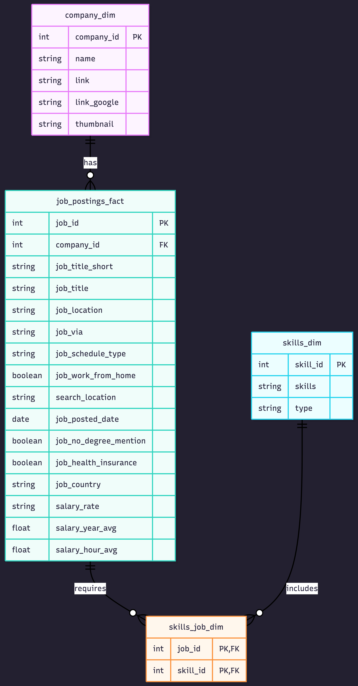
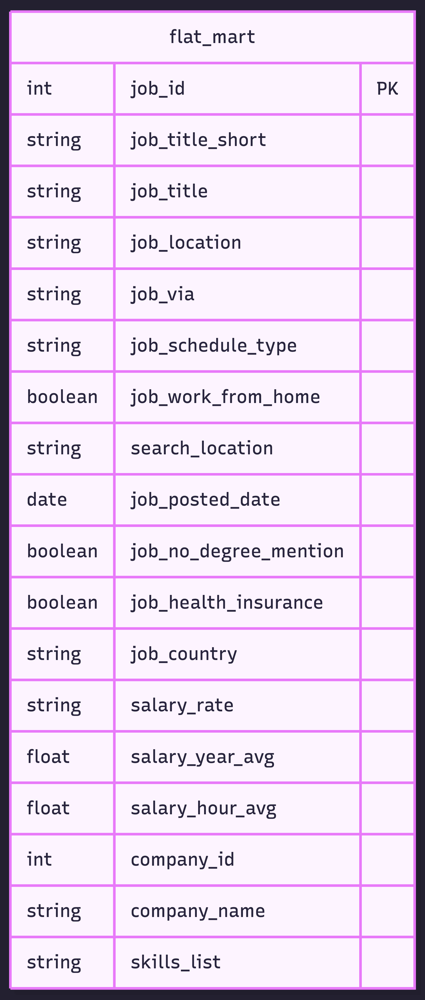
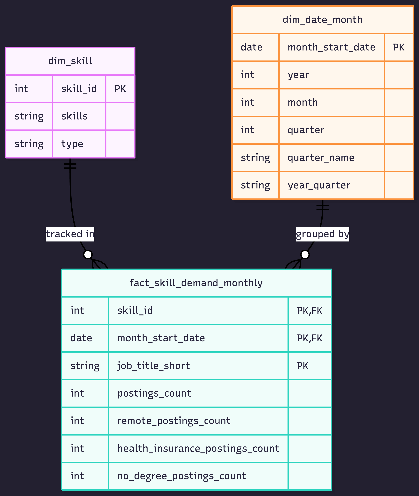
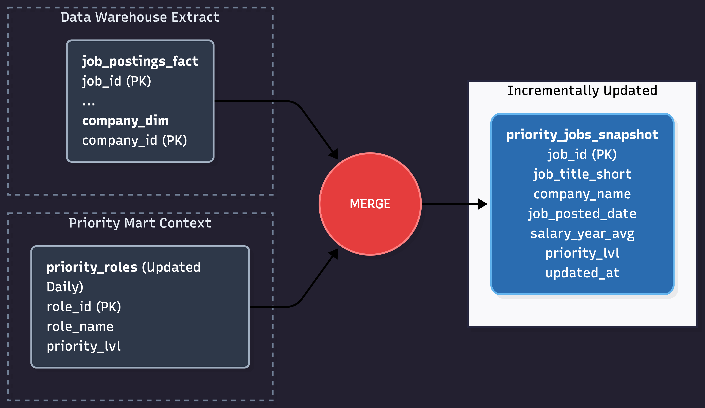

# 🏗️ Data Warehouse & Mart Build: Production ETL Pipeline


---

## 🧾 Executive Summary (For Hiring Managers)

An end-to-end data engineering pipeline that transforms raw CSV files from Google Cloud Storage into a normalized star schema data warehouse, then builds analytical data marts.

- **Pipeline scope**: Built a complete ETL pipeline from raw CSVs → star schema warehouse → analytical marts
- **Data modeling**: Designed a star schema with fact tables, dimensions, and a bridge table for many-to-many relationships
- **ETL development**: Implemented extract, transform, load processes with idempotent operations and data quality checks
- **Mart architecture**: Created specialized data marts (flat, skills, priority) with additive measures and incremental update patterns

---

## 🧩 Problem & Context

Raw job posting data arrives as flat CSV files in Google Cloud Storage — not structured for analytical queries. Analysts need to answer:

- Which skills are most in-demand over time?
- What are hiring trends by company and location?
- How do salary patterns vary by role and skill?

**Challenge**: Data teams need a single source of truth — a data warehouse — to enable consistent, reliable analysis across the organization. Specialized data marts are required to pre-aggregate data for specific business use cases, reducing query complexity and improving performance for common analytical patterns.

**Solution**: End-to-end ETL pipeline that extracts CSVs from cloud storage, normalizes them into a star schema warehouse (separating facts from dimensions), and creates specialized data marts optimized for specific use cases (flat queries, skill demand analysis, priority role tracking).

---

## 🧰 Tech Stack

| Tool | Role |
|------|------|
| **DuckDB** | File-based OLAP database with GCS integration via `httpfs` |
| **SQL** | DDL for schema design, DML for data loading and transformation |
| **Star Schema** | Data model: fact + dimension + bridge tables |
| **VS Code** | SQL editing + DuckDB CLI execution via terminal |
| **Git / GitHub** | Versioned pipeline scripts |
| **Google Cloud Storage** | Source CSV files |

---

## 📂 Repository Structure

```
DW_MART_BUILD/
├── 01_create_tables_dw.sql      # Star schema DDL
├── 02_load_schema_dw.sql        # GCS data extraction & loading
├── 03_create_flat_mart.sql      # Denormalized flat mart
├── 04_create_skills_mart.sql    # Skills demand time-series mart
├── 05_create_priority_mart.sql  # Priority roles mart (initial build)
├── 06_update_priority_mart.sql  # Priority mart incremental update (MERGE)
├── build_dw_marts.sql           # Master SQL orchestration script
├── data/
│   └── dw_marts.duckdb          # Compiled DuckDB database file
└── README.md                    # You are here
```

---

## 🏗️ Pipeline Architecture

The pipeline extracts job posting CSVs from Google Cloud Storage into a normalized star schema data warehouse, then builds specialized analytical data marts. BI tools consume from both the warehouse and marts.


---

## 🗄️ Data Warehouse

The data warehouse implements a star schema with `company_dim`, `skills_dim`, `job_postings_fact`, and `skills_job_dim` tables.

**SQL Files:**
- [`01_create_tables_dw.sql`](./01_create_tables_dw.sql) — Defines star schema with 4 core tables
- [`02_load_schema_dw.sql`](./02_load_schema_dw.sql) — Extracts CSVs from GCS and loads into warehouse tables

**Purpose:** Star schema serving as single source of truth for analytical queries
**Grain:** One row per job posting in the fact table (`job_postings_fact`)



---

## 📋 Flat Mart

Denormalized table with all dimensions joined for ad-hoc queries.

**SQL File:** [`03_create_flat_mart.sql`](./03_create_flat_mart.sql) — Builds denormalized table with all dimensions joined
**Purpose:** Denormalized table for quick ad-hoc queries without runtime joins
**Grain:** One row per job posting with all dimensions flattened and skills packed as a nested struct array



---

## 📈 Skills Mart

Time-series skill demand analysis with additive measures.

**SQL File:** [`04_create_skills_mart.sql`](./04_create_skills_mart.sql) — Builds time-series skill demand mart
**Purpose:** Time-series analysis of skill demand over time with additive measures
**Grain:** `skill_id` + `month_start_date` + `job_title_short`
**Key Features:** All measures are additive (counts/sums) — safe to re-aggregate at any level



---

## 🎯 Priority Mart

Priority role tracking with incremental updates using MERGE operations.

**SQL Files:**
- [`05_create_priority_mart.sql`](./05_create_priority_mart.sql) — Initial build of priority roles lookup and jobs snapshot
- [`06_update_priority_mart.sql`](./06_update_priority_mart.sql) — Incremental update using MERGE (upsert pattern)

**Purpose:** Track priority roles and job snapshots with incremental update capabilities
**Grain:** One row per job posting filtered to priority roles, with priority level and audit timestamp
**Key Features:** MERGE operations for incremental updates — demonstrates production-ready upsert patterns (INSERT, UPDATE, DELETE in a single statement)



---

## 💻 Data Engineering Skills Demonstrated

### ETL Pipeline Development
- **Extract**: Direct CSV loading from Google Cloud Storage using DuckDB's `read_csv()` with `AUTO_DETECT`
- **Transform**: Data normalization, boolean flag aggregation using `CASE WHEN`, and date truncation
- **Load**: Idempotent schema setup with `DROP SCHEMA IF EXISTS CASCADE` + `DROP TABLE IF EXISTS` patterns
- **Incremental Updates**: `MERGE` operations for upsert patterns (INSERT, UPDATE, DELETE in one statement)
- **Orchestration**: Master script (`build_dw_marts.sql`) using `.read` directives for automated pipeline execution

### Dimensional Modeling
- **Star Schema Design**: Fact table (`job_postings_fact`) with dimension tables (`company_dim`, `skills_dim`)
- **Bridge Tables**: Many-to-many relationship handling via `skills_job_dim`
- **Grain Definition**: Proper fact table granularity — `skill_id + month_start_date + job_title_short`
- **Additive Measures**: Counts and sums safely re-aggregatable at any level
- **Date Spine**: Derived `dim_date_month` from fact data with year, month, quarter, and `year_quarter` label

### SQL Advanced Techniques
- **DDL**: `CREATE TABLE`, `DROP TABLE`, `CREATE SCHEMA` with explicit FK constraints
- **DML**: `INSERT INTO ... SELECT` with explicit column mapping from remote CSVs
- **MERGE**: `WHEN MATCHED`, `WHEN NOT MATCHED`, `WHEN NOT MATCHED BY SOURCE` for full SCD-style sync
- **CTEs**: Common Table Expressions for staged boolean flag conversions before aggregation
- **Date Functions**: `DATE_TRUNC('month')`, `EXTRACT(quarter)` for temporal dimension creation
- **Nested Structures**: `ARRAY_AGG(STRUCT_PACK(...))` for semi-structured skill arrays (DuckDB-native)
- **Conditional Aggregation**: `SUM(CASE WHEN ... THEN 1 ELSE 0 END)` to aggregate boolean flags as counts
- **Temp Tables**: `CREATE OR REPLACE TEMP TABLE` for staging data before MERGE operations

### Data Quality & Production Practices
- **Idempotency**: All scripts safely rerunnable without side effects
- **Data Validation**: Record count `UNION ALL` verification queries after each load step
- **Schema Organization**: Separate schemas (`flat_mart`, `skills_mart`, `priority_mart`) for logical separation
- **Type Safety**: Explicit type definitions (`VARCHAR`, `INTEGER`, `DOUBLE`, `BOOLEAN`, `TIMESTAMP`)
- **Progress Reporting**: Inline `SELECT '=== Step ===' AS info` markers for pipeline observability
