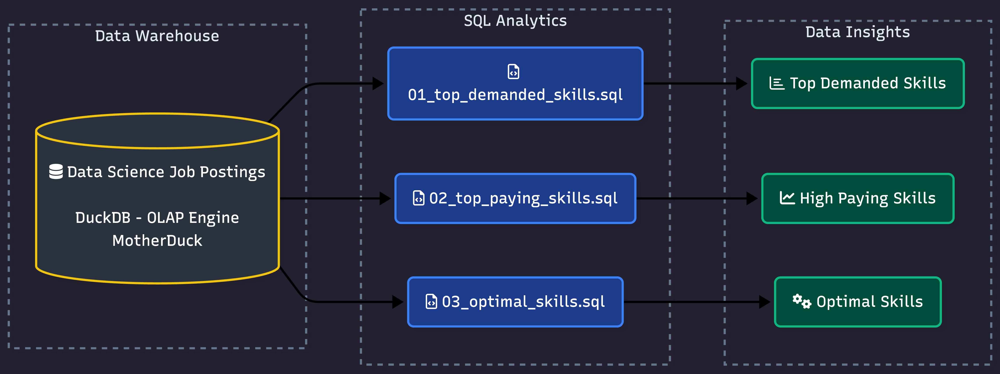
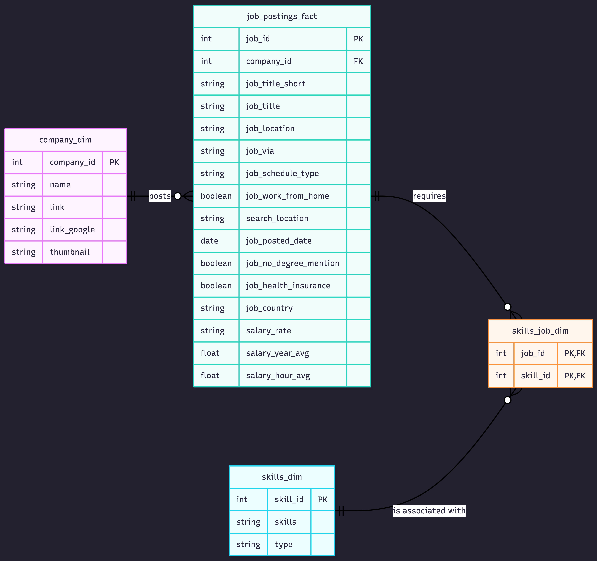

# 🔍 Exploratory Data Analysis w/ SQL: Job Market Analytics



A SQL project analyzing the data engineer job market using real world job posting data. It demonstrates my ability to **write production-quality analytical SQL, design efficient queries, and turn business questions into data-driven insights**.

---

## 🧾 Executive Summary (For Hiring Managers)

- ✅ **Project scope:** Built **3 analytical queries** that answer key questions about the data engineer job market
- ✅ **Data modeling:** Used **multi-table joins** across fact and dimension tables to extract insights
- ✅ **Analytics:** Applied **aggregations, filtering, log transformations, and sorting** to find top skills by demand, salary, and overall value
- ✅ **Outcomes:** Delivered **actionable insights** on SQL/Python dominance, cloud trends, infrastructure salary premiums, and optimal skill prioritization

If you only have a minute, review these:

1. [`01_top_demanded_skills.sql`](./01_top_demanded_skills.sql) – demand analysis with multi-table joins
2. [`02_highest_paying_skills.sql`](./02_highest_paying_skills.sql) – salary analysis with aggregations
3. [`03_Optimal_skills.sql`](./03_Optimal_skills.sql) – combined demand/salary optimization using log normalization

---

## 🧩 Problem & Context

Job market analysts need to answer questions like:

- 🎯 **Most in-demand:** *Which skills are most in-demand for data engineers?*
- 💰 **Highest paid:** *Which skills command the highest salaries?*
- ⚖️ **Best trade-off:** *What is the optimal skill set balancing demand and compensation?*

This project analyzes a **data warehouse** built using a star schema design. The warehouse structure consists of:



- **Fact Table:** `job_postings_fact` - Central table containing job posting details (job titles, locations, salaries, dates, etc.)
- **Dimension Tables:**
  - `company_dim` - Company information linked to job postings
  - `skills_dim` - Skills catalog with skill names and types
- **Bridge Table:** `skills_job_dim` - Resolves the many-to-many relationship between job postings and skills

By querying across these interconnected tables, I extracted insights about skill demand, salary patterns, and optimal skill combinations for remote data engineering roles in the United States.

---

## 🧰 Tech Stack

- 🐤 **Query Engine:** DuckDB for fast OLAP-style analytical queries
- 🧮 **Language:** SQL (ANSI-style with analytical functions)
- 📊 **Data Model:** Star schema with fact + dimension + bridge tables
- 🛠️ **Development:** VS Code for SQL editing + Terminal for DuckDB CLI
- 📦 **Version Control:** Git/GitHub for versioned SQL scripts

---

## 📂 Repository Structure

```text
1_EDA/
├── 01_top_demanded_skills.sql    # Demand analysis query
├── 02_highest_paying_skills.sql  # Salary analysis query
├── 03_Optimal_skills.sql         # Combined demand/salary optimization
└── README.md                     # You are here
```

---

## 🏗 Analysis Overview

### Query Structure

1. **[Top Demanded Skills](./01_top_demanded_skills.sql)** – Identifies the top 10 most in-demand skills for remote data engineer positions in the United States
2. **[Highest Paying Skills](./02_highest_paying_skills.sql)** – Analyzes the 25 highest-paying skills using median salary and demand count, filtered to skills with 100+ postings
3. **[Optimal Skills](./03_Optimal_skills.sql)** – Calculates an optimal score using `LN(demand_count)` combined with median salary to surface the most balanced and practical skills to learn

### Key Insights

- 🧠 **Core languages:** SQL and Python lead demand with 8,665 and 8,118 postings — no other skill is close
- ☁️ **Cloud platforms:** AWS and Azure are the most in-demand cloud skills, critical for modern data engineering roles
- 🧱 **Infra & tooling:** Terraform commands the highest median salary at $192,750 — infrastructure-as-code expertise is rare and highly compensated
- ⚖️ **Best overall skill:** Kubernetes hits both top 10 salary ($155,000) and top 10 demand (960 postings) — the best risk-adjusted skill to learn
- 🔥 **Big data tools:** Spark and Airflow show the strongest balance of salary and demand, making them the most practical big data skills to prioritize

---

## 💻 SQL Skills Demonstrated

### Query Design & Optimization

- **Complex Joins**: Multi-table `INNER JOIN` operations across `job_postings_fact`, `skills_job_dim`, and `skills_dim`
- **Aggregations**: `COUNT()`, `MEDIAN()`, `ROUND()` for statistical analysis
- **Filtering**: Boolean logic with `WHERE` clauses and multiple conditions (`job_title_short`, `job_work_from_home`, `salary_year_avg IS NOT NULL`)
- **Sorting & Limiting**: `ORDER BY` with `DESC` and `LIMIT` for top-N analysis

### Data Analysis Techniques

- **Grouping**: `GROUP BY` for categorical analysis by skill
- **Mathematical Functions**: `LN()` for natural logarithm transformation to smooth exponential demand skew and normalize the optimal score
- **Calculated Metrics**: Derived optimal score combining log-transformed demand with median salary — `ROUND((MEDIAN(salary_year_avg) * LN(COUNT(*)))/1_000_000, 2)`
- **HAVING Clause**: Filtering aggregated results to skills with 100+ postings to ensure statistical reliability
- **NULL Handling**: Proper filtering of incomplete records (`salary_year_avg IS NOT NULL`) to avoid skewing salary calculations