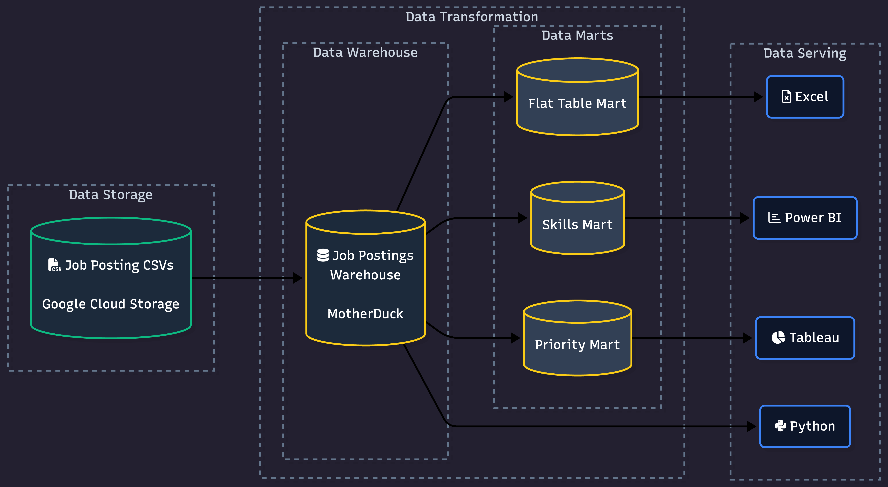

# SQL Data Engineering Projects 

The following projects are a collection of SQL projects that I have worked on to practice and reinforce my skills w/ data engineering tools. 

> Click the project name below to view the tools I used to build these! 

## Projects

### [1.EDA_DWH](EDA_DWH/) - Explanatory Data Analysis

SQL-Driven analysis of data engineer job market trends using advanced querying techniques.

### [2.DW_MART_BUILD](DW_MART_BUILD/) - Data Pipeline - Data Warehouse and Data Mart

End-to-end ETL pipeline transforming raw CSV files into a star schema data warehouse and analytical data marts. 

**Skills**: Dimensional modeling, ETL pipeline development, data mart architecture, production practices
